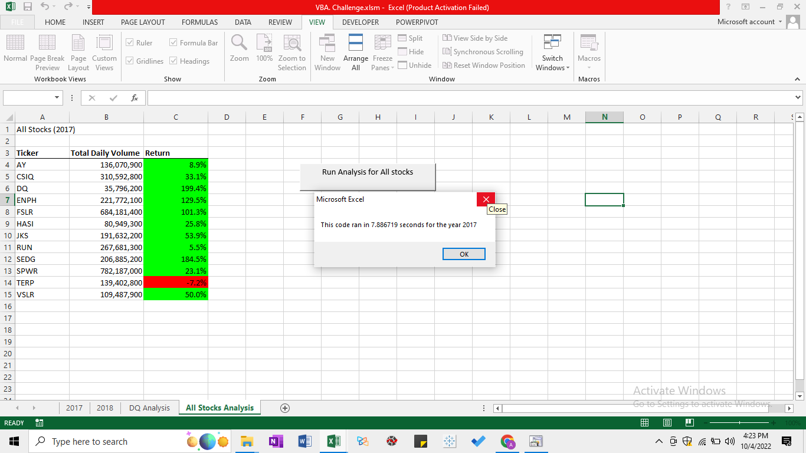
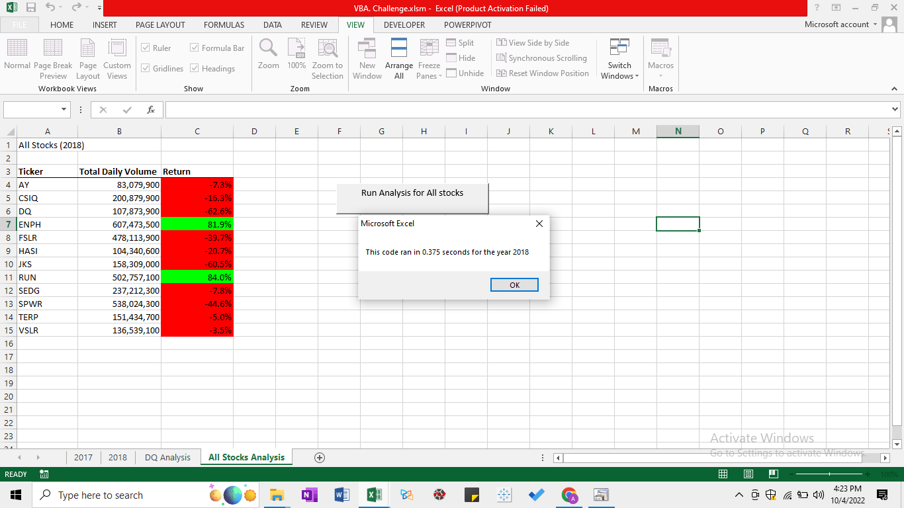

# Stock-Analysis-VBA
Used VBA to compare, analyze stocks, and generate insights to convince investors  

## Overview

In this project, VBA was used for performing Stock Analysis

## Results

In 2017, the stock gains were higher when comared to 2018

IN 2018, daily trading volume was higher when compared to 2017

#### 2017 

#### 2018

### Summary 

##### Advantages of refactoring code
1. Updating and improving a code becomes easier 
2. Reduces error probability 

##### Disadvantages of refactoring code
1. More time consuming
